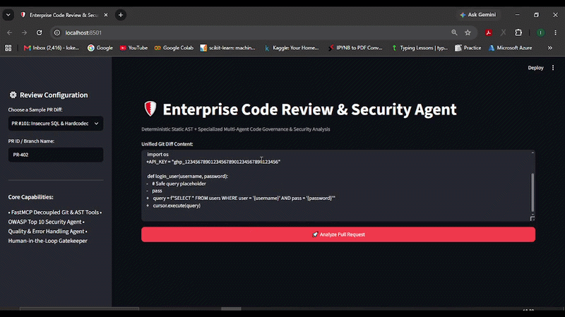

# 🛡️ Enterprise Code Review & Security Agent

[](https://enterprise-code-security-agent-vyqzhy7faqzhac3ocznoqm.streamlit.app/)
[](https://www.python.org/downloads/)
[]()
[-brightgreen.svg>)]()
[-blue.svg>)]()
[](https://github.com/lokeshkundi15/enterprise-code-security-agent)
[](https://opensource.org/licenses/MIT)

## 🌐 Live Application & Demo

- **Live Interactive Dashboard:** [Launch Streamlit App](https://enterprise-code-security-agent-vyqzhy7faqzhac3ocznoqm.streamlit.app/)
- **API Documentation:** Accessible via FastAPI Swagger UI at `/docs`

## 🎬 Live Interactive Demo



## 1. Project Title

**Autonomous Multi-Agent Enterprise Code Review, AST Security & Governance Pipeline**

---

## 2. One-line Business Problem

Engineering teams suffer from code review bottlenecks and alert fatigue due to human reviewers spending hours scanning repetitive syntax/error-handling bugs, while standard LLMs hallucinate false security vulnerabilities on clean pull requests.

---

## 3. Why This Matters

- **Developer Alert Fatigue:** LLM code reviewers without static gating produce high false-positive rates, leading engineers to ignore automated review comments.
- **Critical Vulnerability Leakage:** Subtle SQL injections (`CWE-89`), hardcoded secrets (`CWE-798`), and resource leaks frequently pass manual inspection into production CI/CD pipelines.
- **Context Window Blowups:** Large pull requests (lockfiles, generated assets) crash LLM context windows and inflate token costs.

---

## 4. Solution

A production-inspired code review pipeline built with **LangGraph**, **FastMCP**, **FastAPI**, and **Groq (Llama-3.3-70B)**. It parses unified diffs, applies deterministic AST security and regex scanners, routes code to specialized **Security** and **Quality** LLM agents, deduplicates findings, and enforces **Human-in-the-Loop approval** before publishing review comments.

---

## 5. 🏗️ System Architecture & Stateful Workflow

```text
               [ GitHub Webhook / CLI Pull Request Ingestion ]
                                      │ (HMAC-SHA256 Signature Check & In-Memory Idempotency)
                                      ▼
                           ┌─────────────────────┐
                           │ FastAPI Webhook API │
                           └──────────┬──────────┘
                                      │
                                      ▼
                      ┌───────────────────────────────┐
                      │      FastMCP Tool Registry     │
                      ├───────────────────────────────┤
                      │ • parse_pr_diff               │
                      │ • scan_static_security (AST)  │
                      └───────────────┬───────────────┘
                                      │
                                      ▼
                      ┌───────────────────────────────┐
                      │    LangGraph State Machine    │
                      ├───────────────────────────────┤
                      │ 1. Parse & Chunk Diff Files   │
                      │ 2. Deterministic AST Scans    │
                      │ 3. Security Agent (LLM)       │
                      │ 4. Quality Agent (LLM)        │
                      │ 5. Aggregator & Deduplication │
                      └───────────────┬───────────────┘
                                      │
                                      ▼
                         ┌───────────────────────────┐
                         │   Streamlit Operator UI   │ ──► Human-in-the-Loop Gateway
                         └───────────────────────────┘     (Approve & Post to GitHub)
```

---

## 6. Key Features

- **Deterministic AST Security Scanning:** Python AST-based analysis that catches SQL injections (`CWE-89`), hardcoded secrets/tokens (`CWE-798`), unclosed file handles (`CODE-001`), and bare exceptions (`CODE-002`) without relying on the LLM for detection.
- **Token-Bounded Diff Chunker** (`app/core/chunker.py`): Automatically filters out noisy dependency lockfiles (`package-lock.json`, `uv.lock`, etc.) and bounds file diffs to 250 lines to eliminate LLM context window blowups on large PRs.
- **Deduplicating Aggregator:** Deduplicates overlapping findings across the static scanner, security agent, and quality agent by `(file_path, line_start, category, title)` and sorts results by severity (CRITICAL → INFO).
- **Webhook Security & Idempotency:** FastAPI endpoint with HMAC-SHA256 signature verification and delivery-ID-based deduplication, skipping duplicate GitHub webhook deliveries.
- **Human-in-the-Loop Governance:** Write operations (posting review comments) are gated behind explicit operator confirmation in the Streamlit dashboard — the agent never auto-merges or auto-comments.

---

## 7. Technical Decisions

- **Deterministic AST/regex checks + LLM agents, not LLM-only:** Security-critical findings (secrets, SQL injection patterns) are detected with a Python AST visitor and regex rules first. The LLM is used to reason about *contextual* issues (auth logic, error handling patterns) rather than being the sole source of security findings — this reduces hallucinated vulnerabilities on clean code.
- **LangGraph over a plain function chain:** The 5-node pipeline (`parse_diff → static_scan → security_agent → quality_agent → aggregator`) is currently a linear sequence. LangGraph was chosen so branching (e.g., skipping the LLM agents entirely for a PR the static scanner already marks CRITICAL) can be added without restructuring the pipeline.
- **FastMCP tool registration (in progress):** `app/mcp_server/server.py` registers `parse_pr_diff` and `scan_static_security` as MCP tools. The LangGraph nodes currently call the underlying functions directly rather than through a live MCP client-server session — this is a known gap, not yet a fully wired protocol call.

---

## 8. Evaluation Methodology & Results

A 7-case golden benchmark dataset (`evaluation/dataset.json`) was built covering 3 security cases (SQL injection, hardcoded token, bearer token), 2 code-quality cases (resource leak, bare except), and 2 clean-code cases with no expected findings. `evaluation/benchmark.py` runs the full pipeline end-to-end on each case and computes true/false positive and negative counts directly — no self-referential scoring.

| Metric | Result |
|---|---|
| Total Test Cases | 7 |
| True Positives (issues caught) | 5 |
| True Negatives (clean code verified) | 2 |
| False Positives | 0 |
| False Negatives | 0 |
| Recall (Detection Rate) | 100.0% |
| False Positive Rate (FPR) | 0.0% |
| Average Execution Latency | ~6,364 ms / PR |
| Pydantic Schema Validity | 100.0% |

**Scope note:** This benchmark is deliberately small (7 cases) and was constructed to match known patterns the deterministic AST/regex scanner is designed to catch — it validates that the deterministic layer works correctly, not that the LLM agents independently generalize to unseen vulnerability types. A larger, more adversarial dataset would be needed to claim broader security coverage.

---

## 9. Failure Cases Handled

- **Duplicate webhook delivery:** Detected via `X-GitHub-Delivery` header and skipped before triggering a second pipeline run.
- **Invalid webhook signature:** Rejected with HTTP 401 when `ENVIRONMENT=production` and the HMAC signature doesn't match.
- **Non-Python diff content:** Falls back to regex-only secret/SQL-pattern matching if AST parsing fails (e.g., on a malformed or non-Python diff chunk).
- **Oversized diffs:** Truncated to 250 lines per file with an explicit `[TRUNCATED]` marker rather than silently dropping content or crashing.

---

## 10. Known Limitations (Honest Assessment)

- **LLM calls feature exponential backoff retry (3 attempts, 12s timeout)** with graceful fallback to static AST findings if the upstream API fails.
- **MCP tools are registered but not invoked through a live client-server session** — see Technical Decisions above.
- **Idempotency store is in-memory** (a Python `set`), not persisted — it resets on process restart. Fine for demo purposes, not suitable for a multi-instance production deployment.
- **Deduplication is exact-match only** (`file_path, line_start, category, title`) — two findings describing the same underlying issue with slightly different titles from different agents will not be merged.
- **Evaluation dataset is small (7 cases)** and does not cover LLM timeout, malformed LLM output, or MCP tool failure scenarios yet.

---

## 11. Quickstart & Local Installation

```bash
# 1. Clone Repository
git clone https://github.com/lokeshkundi15/enterprise-code-security-agent.git
cd enterprise-code-security-agent

# 2. Setup Virtual Environment
python -m venv venv
venv\Scripts\activate  # On Linux/macOS: source venv/bin/activate

# 3. Install Dependencies
pip install -r requirements.txt

# 4. Configure Environment Variables
# Create a .env file with:
# GROQ_API_KEY=your_groq_api_key_here
# WEBHOOK_SECRET=dev_webhook_secret_key

# 5. Run Benchmark Evaluation
python evaluation/benchmark.py

# 6. Run Pytest Regression Suite
pytest -v

# 7. Launch Streamlit Dashboard
streamlit run app/ui/dashboard.py
```

---

## 12. Project Structure

```text
enterprise-code-security-agent/
├── app/
│   ├── api/
│   │   └── routes.py              # FastAPI webhook, HMAC verification, idempotency
│   ├── core/
│   │   ├── config.py              # Pydantic Settings & environment loader
│   │   ├── state.py               # LangGraph ReviewState schema (TypedDict)
│   │   ├── graph.py               # StateGraph pipeline definition
│   │   ├── chunker.py             # Diff chunking & lockfile filter
│   │   ├── aggregator.py          # Finding deduplication & severity sort
│   │   └── logger.py              # Structured logging
│   ├── agents/
│   │   └── specialized_agents.py  # Security & Quality LLM agents
│   ├── mcp_server/
│   │   ├── server.py              # FastMCP tool registration
│   │   └── tools/
│   │       ├── ast_scanner.py     # Deterministic AST & secret-pattern rules
│   │       └── diff_parser.py     # Unified git diff parser
│   ├── schemas/
│   │   └── findings.py            # Pydantic schemas (CodeFinding, ReviewReport)
│   └── ui/
│       └── dashboard.py           # Streamlit Human-in-the-Loop UI
├── evaluation/
│   ├── dataset.json               # Golden benchmark PR dataset (7 cases)
│   └── benchmark.py                # Benchmark runner (TP/FP/FN calculation)
├── tests/
│   ├── test_schemas.py            # Pydantic model validation tests
│   ├── test_ast_tools.py          # AST & diff parser unit tests
│   ├── test_graph_flow.py         # Full LangGraph pipeline test
│   ├── test_chunker.py            # Context bounding & filter tests
│   └── test_webhook.py            # FastAPI idempotency & route tests
├── Dockerfile
├── docker-compose.yml
├── pytest.ini
├── requirements.txt
├── DECISIONS.md                   # Architecture decision records
├── EVALUATION.md                  # Benchmark evaluation results
└── README.md
```

---

## 13. Core Architectural Decisions (Interview Q&A style)

**Why deterministic AST/regex checks instead of relying only on the LLM?**
An LLM alone can miss known-pattern vulnerabilities or hallucinate findings on clean code. The AST visitor and regex rules catch specific, well-defined patterns (SQL string interpolation into `.execute()`, secret-like tokens, bare `except:`) with 100% deterministic reliability, and the LLM agents are reserved for reasoning that genuinely benefits from context (authorization logic, edge-case error handling).

**Why LangGraph for a currently-linear pipeline?**
Today's graph is a straight 5-node sequence, so it behaves like a plain function chain. LangGraph was chosen so conditional routing can be added later — for example, short-circuiting the LLM agents when the static scanner already finds a CRITICAL issue, to save cost and latency.

**Why is MCP only partially wired?**
The tools are registered as MCP tools (`@mcp.tool()`), but the LangGraph nodes currently call the underlying Python functions directly rather than through a live MCP client-server round trip. This is an explicit, acknowledged gap — full protocol wiring is a planned next step, not a claimed-complete feature.

**Why Human-in-the-Loop instead of auto-posting comments?**
The static and LLM findings are not perfect (the 7-case benchmark is small and not adversarial). Requiring explicit operator approval before any GitHub write operation prevents a false positive from becoming a public, incorrect PR comment.

**Why measure Recall/FPR on only 7 cases?**
The dataset size is an honest constraint of the time available for this portfolio project. The methodology (real end-to-end pipeline execution, real TP/FP/FN counting) is sound and would scale directly to a larger dataset — the current numbers should be read as "the deterministic scanner works correctly on its target patterns," not as a claim of broad, general security coverage.

---

## 14. Interview Talking Points

**Problem:** Engineering teams spend significant time on repetitive first-pass PR review (secrets, SQL injection, missing error handling), and a naive LLM-only reviewer produces too many false positives to be trusted.

**Solution:** I built a multi-stage pipeline that combines deterministic AST/regex security scanning with specialized LLM agents for security and code-quality reasoning, deduplicates and severity-ranks the combined findings, and requires human approval before any GitHub write action.

**Engineering decision:** Rather than trusting the LLM to catch everything, I split detection into a deterministic layer (for known, well-defined patterns) and an LLM layer (for contextual reasoning) — this is measurable via the benchmark's 0% false-positive rate on the deterministic checks.

**Known gaps I'm upfront about:** No retry/fallback on LLM calls yet, MCP is registered but not fully wired as a live client-server call, and the evaluation dataset is small (7 cases). I can explain the fix for each of these and why they weren't blocking for a first version.

**Trade-off:** Human-in-the-loop approval adds a manual step versus a fully autonomous reviewer, but given the current false-positive risk on a small evaluation set, this is the right trade-off for a system that writes to a real GitHub PR.